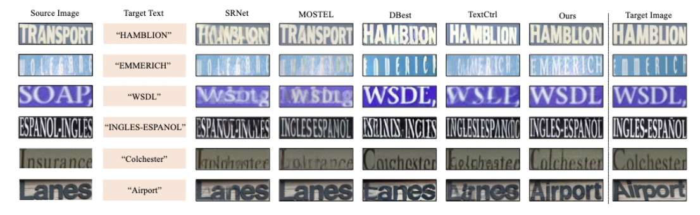

This anonymous repository contains the implementation of the paper:

> RealTE: Real-world Data Facilitates Scene Text Editing <br>


## Installation
```bash
conda create --name RealTE python=3.9 -y
conda activate RealTE
pip install -r requirements.txt
```

# 1. Training
You can use `train.sh` for training:
```bash
CUDA_VISIBLE_DEVICES=0,1 accelerate launch --main_process_port=8888 train.py \
    --train_batch_size 2 \
    --resume ./exp/resume_ckpt/  \
    --mixed_precision "fp16" \
    --enable_xformers_memory_efficient_attention \
    --output_dir ./exp/test \
    --data_root your_path \
    --datasets unpaired_dataname/paired_dataname
    
```
## prepare training datasets
You need to organize your data in a manner similar to the following:
```
├── Your data_root
│   ├── IC13_857 (unpaired data)
│   │   │── data.mdb
│   │   │── lock.mdb
│   ├── train-50k-1
│   │   │── i_s
│   │   │── t_f
│   │   │── i_t.txt
```
You download commonly used English recognition datasets (unpaired scene text editing dataset) via [ABINet](https://github.com/FangShancheng/ABINet/tree/main). You can refer to [MOSTEL](https://github.com/qqqyd/MOSTEL) to download the synthetic paired data.

Note: Please note that in the current code repository, the default format for unpaired data is LMDB, while paired data follows the format of `train-50k`. If you wish to use a custom dataset, please modify the `dataloader/dataloader.py` implementation accordingly.

# 2. Inference and Evaluation
## 2.1 Trained model
The finetuned ckpt can be downloaded from [BaiduNetdisk](https://pan.baidu.com/s/1MZtzyKwd7fUSvUGoR7ykVw?pwd=phdg).

## 2.2 Benchmarks
You can download ScenePair from [TextCtrl](https://github.com/weichaozeng/TextCtrl/) and Tamper-Scene/Tamper-Synth from [MOSTEL](https://github.com/qqqyd/MOSTEL).
You can use `infer.sh` for inference:
```bash
python infer_sft_model.py \
    --image_root datasets/evaluation/Tamper-Scene/i_s \
    --template_path datasets/evaluation/Tamper-Scene/i_t.txt \
    --output_path test/eval_res/Tamper_scene/ \
    --model_path your_ckpt

python infer_sft_model.py \ 
    --image_root datasets/evaluation/ScenePair/i_s \
    --template_path datasets/evaluation/ScenePair/i_t.txt \
    --output_path test/eval_res/ScenePair/ \
    --model_path your_ckpt

```
In the provided example inference command, it is required by default to organize the benchmark in the following format:
```
├── datasets
│   ├── Tamper-Scene
│   │   │── i_s
│   │   │── i_t.txt
│   ├── ScenePair
│   │   │── i_s
│   │   │── t_f
│   │   │── i_t.txt
│   │   │── i_s.txt
...
```
## 2.3 Evaluation
```bash
cd evaluation_mostel
```
### Recognition Accuracy
```bash
python eval_real.py --saved_model models/TPS-ResNet-BiLSTM-Attn.pth --gt_file ../datasets/evaluation/ScenePair/i_t.txt --image_folder ../test/eval_res/ScenePair/gen_images/
```
### MSE/PSNR/SSIM/FID
```bash
CUDA_VISIBLE_DEVICES=1 python evaluation.py \
    --gt_path ../datasets/evaluation/ScenePair/t_f/ \
    --target_path ../test/eval_res/ScenePair/gen_images/
```
